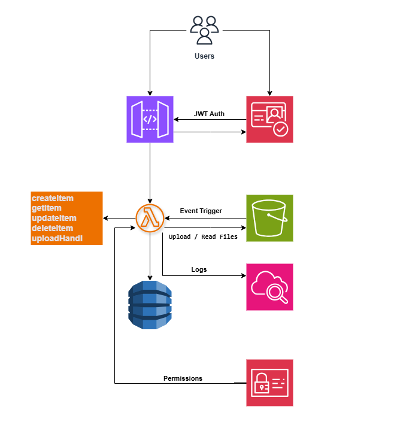
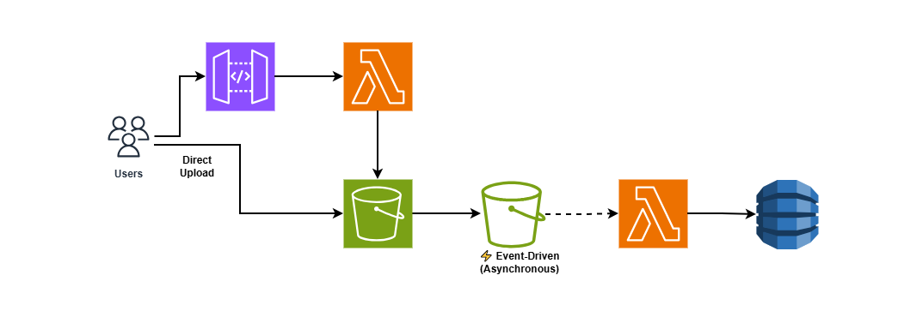

# 🚀 MediFlow Serverless API


A **production-grade serverless backend** built entirely on AWS. MediFlow serves as a comprehensive reference architecture showcasing highly scalable infrastructure, asynchronous event-driven processing, and secure API design.

## 🎯 Project Overview

MediFlow Serverless API was built to demonstrate modern backend engineering practices. Instead of managing traditional servers, this project leverages AWS managed services to create a system that scales automatically, charges only for exact usage, and maintains high availability.

**Key Engineering Focus Areas:**
* **Scalability:** Fully serverless compute and database layers.
* **Event-Driven Architecture:** Decoupling uploads from processing using S3 event triggers.
* **Security-First:** JWT-based authentication via Cognito and strictly scoped IAM roles.
* **Infrastructure as Code (IaC):** 100% reproducible environments managed by Terraform.

---

## 🛠️ Tech Stack

* **Compute:** AWS Lambda, Amazon API Gateway
* **Storage & Database:** Amazon DynamoDB, Amazon S3
* **Authentication:** Amazon Cognito (JWT)
* **Infrastructure as Code:** Terraform
* **CI/CD:** GitHub Actions
* **Observability:** Amazon CloudWatch (Structured JSON Logging)
* **Language:** Node.js / JavaScript

---

## 🏗️ Architecture



### The Event-Driven Pipeline


To handle large file uploads without tying up API Gateway resources, the system uses the **Presigned URL pattern**:
1. Client requests a secure upload URL from the API.
2. API Gateway invokes a Lambda that returns a time-bound **Presigned S3 URL**.
3. Client uploads the file directly to the S3 bucket.
4. S3 triggers an asynchronous Lambda function.
5. The Lambda processes the file and updates metadata in DynamoDB.

---

## 📡 API Endpoints

| Method | Endpoint        | Protected | Description                     |
|--------|----------------|-----------|---------------------------------|
| `POST` | `/items`       | 🔒 Yes    | Create a new item record        |
| `GET`  | `/items/{id}`  | 🔒 Yes    | Retrieve item details           |
| `POST` | `/upload-url`  | 🔒 Yes    | Generate an S3 Presigned URL for direct uploads |

---

## 💻 Example Usage

All protected endpoints require a valid JWT from Amazon Cognito.

### 1. Create an Item
```bash
curl -X POST https://api-url/items \
  -H "Authorization: Bearer <JWT_TOKEN>" \
  -H "Content-Type: application/json" \
  -d '{"name":"Test Item"}'

2. Get an Item
curl -X GET https://api-url/items/{id} \
  -H "Authorization: Bearer <JWT_TOKEN>"

3. Request a Direct Upload URL
curl -X POST https://api-url/upload-url \
  -H "Authorization: Bearer <JWT_TOKEN>" \
  -H "Content-Type: application/json" \
  -d '{"fileName":"medical-scan.jpg"}'

📂 Project Structure
mediflow-serverless-api/
├── app/                  # Lambda functions & core business logic
│   ├── handlers/         # API Gateway entry points
│   ├── services/         # Reusable business logic
│   └── utils/            # Shared utilities (logging, validation)
├── infrastructure/       # Terraform IaC definitions
│   └── terraform/
│       └── modules/      # Modularized AWS resources
├── events/               # Sample JSON payloads for local Lambda testing
├── tests/                # Unit and integration test suites
├── docs/                 # Architecture diagrams and documentation
└── .github/workflows/    # CI/CD pipelines


🚀 Deployment & Setup
This project utilizes GitHub Actions for automated CI/CD. Push to the main branch to trigger the deployment pipeline.

Prerequisites: Terraform Remote State
Before deploying via CI/CD, bootstrap the remote state storage for Terraform:

# Create S3 bucket for state files
aws s3 mb s3://mediflow-terraform-state

# Create DynamoDB table for state locking
aws dynamodb create-table \
  --table-name mediflow-terraform-lock \
  --attribute-definitions AttributeName=LockID,AttributeType=S \
  --key-schema AttributeName=LockID,KeyType=HASH \
  --billing-mode PAY_PER_REQUEST


CI/CD Setup
Add the following secrets to your GitHub Repository:

AWS_ACCESS_KEY_ID

AWS_SECRET_ACCESS_KEY

Go to Actions → Deploy Dev → Run Workflow.

🧪 Testing & Observability
Testing
# Run unit tests
npm test

# Simulate S3 event trigger locally
node tests/s3Upload.test.js


Observability
CloudWatch Integration: All Lambda functions are configured to send structured JSON logs to CloudWatch.

Request Tracing: Correlated request IDs are tracked across API Gateway, Lambda, and DynamoDB to simplify debugging in distributed systems.

🔐 Security Best Practices Implemented
Authentication: All API routes are protected by Amazon Cognito Custom Authorizers.

Least Privilege IAM: Lambda execution roles are strictly scoped (e.g., specific dynamodb:PutItem access rather than dynamodb:*).

Direct-to-S3 Uploads: Prevents malicious file payloads from passing directly through the application compute layer.

Secret Management: No hardcoded credentials; environment variables and secure injection are used throughout.

👨‍💻 Author
Biruk-Kasahun

Cloud & Backend Engineer

 |  